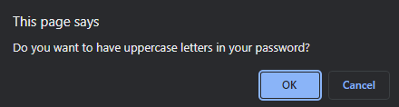

# Random-Password-Generator

[Link to my project](https://cujion.github.io/random-pasword-generator/)

## Table of Contents
- [Description](#description)
- [Visuals](#visuals)
- [Installation](#installation)
- [License](#license)

## Description
* This project is designed to give you a basic understand of how javascript 
works. In this project there are features that include creating variables, 
if/ else if statements, concat functions to create a pool of options for your 
random password generator, and a math.floor which sets the value to the nearest 
whole number and then a math.random which randomly selects out of the pool of 
options you picked to be able to generate a password for you.

## Visuals

## Installation
* Open the index.html file in a web browser to display the website. To access 
the code while in the web browser of google chrome right click on the page and 
click inspect and it will open up the chrome dev tools which will allow you to 
see the javascript along with the console.log of what and how the script is 
running in order to generate a random password for this webpage. 

## License
* MIT License

* Copyright (c) [2022]] [christopher bonime]

* Permission is hereby granted, free of charge, to any person obtaining a copy
of this software and associated documentation files (the "Software"), to deal
in the Software without restriction, including without limitation the rights
to use, copy, modify, merge, publish, distribute, sublicense, and/or sell
copies of the Software, and to permit persons to whom the Software is
furnished to do so, subject to the following conditions:

* The above copyright notice and this permission notice shall be included in all
copies or substantial portions of the Software.

* THE SOFTWARE IS PROVIDED "AS IS", WITHOUT WARRANTY OF ANY KIND, EXPRESS OR
IMPLIED, INCLUDING BUT NOT LIMITED TO THE WARRANTIES OF MERCHANTABILITY,
FITNESS FOR A PARTICULAR PURPOSE AND NONINFRINGEMENT. IN NO EVENT SHALL THE
AUTHORS OR COPYRIGHT HOLDERS BE LIABLE FOR ANY CLAIM, DAMAGES OR OTHER
LIABILITY, WHETHER IN AN ACTION OF CONTRACT, TORT OR OTHERWISE, ARISING FROM,
OUT OF OR IN CONNECTION WITH THE SOFTWARE OR THE USE OR OTHER DEALINGS IN THE
SOFTWARE.
